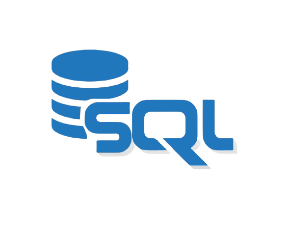

# Hey, I’m Annarhysa 
 

  👀 I am an Artificial Intelligence and Data Science enthusiast 
  🤖 I’m currently practicing Machine Learning and it's applications in various fields 
  🫂 I’m want to collaborate on projects related to Data Science and Machine Learning   
  📖 I'm looking for research internships in Machine Learning 
  📫 annarhysa13@gmail.com   
  🕸️ <a href = "https://annarhysa-albert.my.canva.site/">My Portfolio</a>

  

 

  
  
  
  
 <!--- 
  ) --->

 
 

## 👩‍💻 Tech Stack
<h3>Languages and tools I work with   

 

 

 

  

  
 

<h3>Libraries (Python) I am interested/expertize in  

 

  
  
  
  
## 📈 Profile Stats

  
      
  
  

## 🔝 Top Repositories

<!---
Annarhysa/Annarhysa is a ✨ special ✨ repository because its `README.md` (this file) appears on your GitHub profile.
You can click the Preview link to take a look at your changes.
--->
